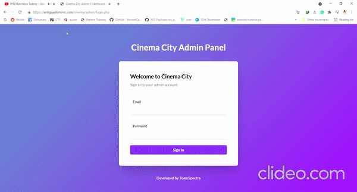
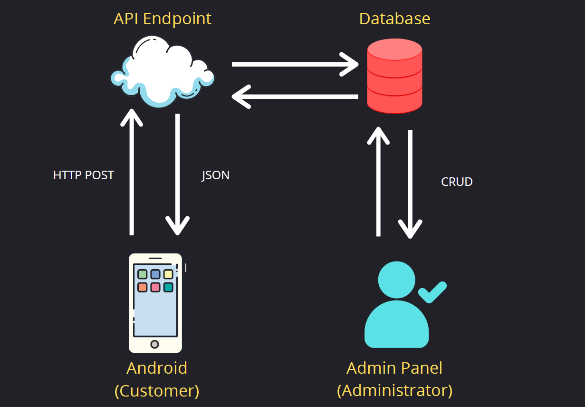

# Cinema City

Cinema City is a database system that allows the clients to reserves seats in an easy quick few steps than traditional purchasing of tickets. The system has an own android application for the customers that allows them to reserves seats and purchase tickets in a convenient way, and a web admin panel that manages the movies they will show and sell to the customers, and also monitoring the sales of the business. This system will be appreciated by the cinema lovers because there is no need to fight for a great seat and no line queue to wait. This project was used in Information Management Subject in my 2nd year college days.

## Flutter Android Application
To use the flutter application, please edit the server_api and server_url to your localhost ip address from constant.dart in lib folder.

## PHP Web Application
Import first the SQL database into the MYSQL and upload it to your local server. The defaul user in the web admin is 
(user: teamspectra@gmail.com | pass: admin)

 

## System Structure

 
